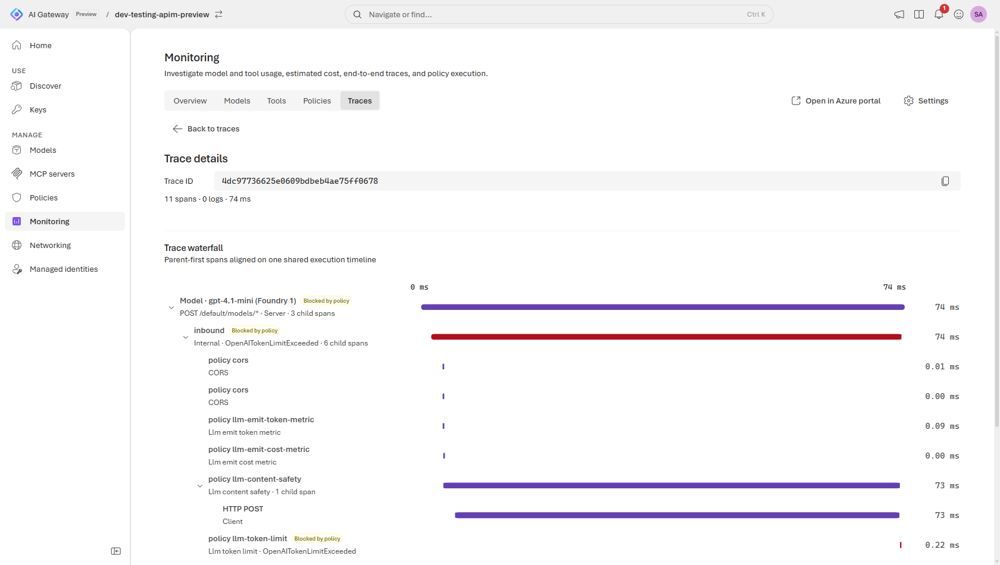

# APIM + Azure AI Foundry — Workshop de AI Gateway

Workshop práctico para presentar a un cliente **todas las opciones** de consumir modelos de
**Azure AI Foundry** de forma gobernada usando **Azure API Management (APIM) como AI Gateway**
(la arquitectura de referencia de Microsoft para GenAI).

El hilo conductor: los desarrolladores usan **su herramienta preferida** (Claude Code "cloud
code", GitHub Copilot CLI, o cualquier SDK OpenAI) pero **todo el tráfico pasa por APIM**, que
aplica límites de tokens, métricas de coste, balanceo, caché semántica, seguridad de contenido
e identidad administrada — sin claves en el cliente.

---

## 🗺️ Arquitectura

```
  GitHub Copilot CLI / gh ──(OpenAI)────┐
  OpenAI SDK (Python/Node) ─(OpenAI)────┤
  Claude Code ─(Anthropic)──────────────┤  ◄─ APIM traduce el protocolo (lab 12)
                                        ├──► APIM ──(Managed Identity, keyless)──► Azure AI Foundry
  Claude Code ─(Anthropic)─► LiteLLM ───┘     │                                   ├─ chat  (gpt-4.1-mini) ×2 backends
      (opcional, lab 08)     (traduce)        │                                   └─ embeddings (text-embedding-3-small)
                                              │
                                      Application Insights    ◄─ métricas de tokens/coste
                                      Azure Managed Redis     ◄─ semantic cache
                                      Azure AI Content Safety ◄─ jailbreak / prompt shield
```

Todos los clientes convergen en el **mismo endpoint expuesto por APIM**. El caso interesante es
Claude Code: habla protocolo **Anthropic** y Foundry habla **OpenAI**, así que alguien tiene que
traducir. Lo habitual es meter **LiteLLM** en medio — un contenedor más que desplegar, operar y
securizar. **No hace falta: la traducción cabe en la política de APIM**
([lab 12](labs/12-claude-code-sin-litellm.md)), y así el gateway que ya tienes es el único salto.

### ¿Hace falta LiteLLM?

| | **APIM traduce** ([lab 12](labs/12-claude-code-sin-litellm.md)) | **LiteLLM traduce** ([lab 08](labs/08-cliente-claude-code.md)) |
|---|---|---|
| Piezas que operas | **ninguna extra** | contenedor + su ciclo de vida |
| Saltos de red | Claude Code → APIM → Foundry | Claude Code → LiteLLM → APIM → Foundry |
| Credenciales | **una** (la de APIM) | dos (master key de LiteLLM + la de APIM) |
| Gobierno (tokens, balanceo, métricas) | nativo, misma API y producto | nativo, pero el proxy queda **fuera** del gateway |
| Proveedores soportados | los de Foundry | **~100** (Bedrock, Vertex, Cohere…) |
| *Streaming* | se **sintetiza** al final de la respuesta | **token a token** real |

> **En corto:** si tus modelos están en Foundry, LiteLLM es una pieza móvil que no aporta nada
> que APIM no haga ya. Sigue mereciendo la pena si necesitas *streaming* token a token o modelos
> de otros proveedores cloud — por eso el lab 08 se mantiene en el workshop.

---

## 🍽️ Menú de opciones (lo que puedes enseñar al cliente)

### A. Herramienta del desarrollador (cómo consumen los modelos)
| Opción | Protocolo | Ruta | Lab |
|--------|-----------|------|-----|
| **Claude Code sin LiteLLM** ⭐ | Anthropic | Claude Code → APIM (traduce) → Foundry (OpenAI) | [12](labs/12-claude-code-sin-litellm.md) |
| **Claude Code → Claude nativo** | Anthropic | Claude Code → APIM → Foundry (Claude) | [11](labs/11-claude-en-foundry.md) |
| **Claude Code con LiteLLM** | Anthropic | Claude Code → LiteLLM → APIM → Foundry | [08](labs/08-cliente-claude-code.md) |
| **GitHub Copilot CLI + `gh`** | — | Copilot nativo + `gh copilot` en terminal | [09](labs/09-cliente-copilot-cli.md) |
| **OpenAI SDK genérico** | OpenAI | App → APIM → Foundry | [01](labs/01-desplegar-y-primera-llamada.md) |
| **Foundry directo** (línea base) | OpenAI | App → Foundry (sin gobierno) | comparativa |

⭐ = ruta recomendada: sin contenedor intermedio.

### B. APIM como AI Gateway (el núcleo)
| Módulo | Política | Lab |
|--------|----------|-----|
| Límite de tokens / rate limiting | `llm-token-limit` | [02](labs/02-token-limit.md) |
| Métricas de tokens y **coste** | `llm-emit-token-metric` → App Insights | [03](labs/03-metricas-y-costes.md) |
| Balanceo de carga / failover | backend **pool** + circuit breaker | [04](labs/04-balanceo-y-failover.md) |
| Caché semántica | `azure-openai-semantic-cache-*` + Redis | [05](labs/05-semantic-cache.md) |
| Content safety / jailbreak | `llm-content-safety` (prompt shields) | [06](labs/06-content-safety.md) |
| Managed Identity (keyless) | `authentication-managed-identity` | [07](labs/07-managed-identity.md) |
| Gobierno de **MCP** | exponer/gobernar servidores MCP | [10](labs/10-mcp.md) |

### C. Alternativa: el SKU *AI Gateway* (preview)
Existe un tier nuevo de APIM específico para tráfico de IA, donde los modelos, las herramientas
MCP y las políticas se configuran **sin escribir XML**. Gana en MCP (conectores integrados,
OpenAPI→tools) y pierde caché semántica y balanceo. Comparativa y matriz de portabilidad en el
[lab 13](labs/13-ai-gateway-tier.md), que trae **scripts para montarlo, probarlo y medirlo**
de punta a punta:

```powershell
cd scripts
./aigw-setup.ps1         -GatewayName <gw> -GatewayResourceGroup <rg>   # modelos, MCP, políticas, telemetría OTLP
./aigw-test.ps1          -GatewayName <gw> -GatewayResourceGroup <rg>   # prueba de humo
./aigw-policies-test.ps1 -GatewayName <gw> -GatewayResourceGroup <rg> -Demo   # guardarraíles: 400 / 403 / 429
./aigw-metrics.ps1                                                      # tokens y coste reales
./aigw-traces.ps1                                                       # trazas: qué política se evaluó y cuánto tardó
```

Lo que se obtiene al final: una traza que demuestra el gobierno en ejecución.



*Una petición **frenada por el gateway antes de llegar al modelo** — no hay span de `backend`, así
que no se ha pagado ni un token. El motivo aparece en el span exacto que la cortó
(`llm-token-limit · OpenAITokenLimitExceeded`) y cada guardarraíl trae su coste en milisegundos.
Un proxy LLM te dice que hubo un 429; esto te dice **quién lo decidió, por qué y qué te costó**.*

---

## ✅ Requisitos previos

- Suscripción de Azure con permisos de Colaborador + capacidad de asignar roles.
- [Azure CLI](https://learn.microsoft.com/cli/azure/) con la extensión Bicep (`az bicep version`).
- **PowerShell 7+** (`pwsh`): los labs y scripts están escritos para él.
- [GitHub CLI](https://cli.github.com/) (`gh auth status`).
- [Docker](https://www.docker.com/) — **solo** para el puente LiteLLM del [lab 08](labs/08-cliente-claude-code.md); la ruta recomendada ([lab 12](labs/12-claude-code-sin-litellm.md)) no lo necesita.
- Python 3.10+ (para los scripts de prueba).

---

## 🚀 Quickstart

```powershell
# 1. Desplegar el núcleo (Foundry x2 + APIM Developer + monitorización)
./scripts/deploy.ps1                 # APIM Developer tarda ~40 min

# 2. Obtener endpoint y clave
./scripts/get-keys.ps1

# 3. Primera llamada gobernada
$env:APIM_GATEWAY_URL="https://xxxxx-apim.azure-api.net"
$env:APIM_SUBSCRIPTION_KEY="<clave>"
pip install openai
python clients/test-openai.py
```

Después, sigue el [**recorrido de labs**](labs/README.md) — del 00 al 13, con lo que necesita
cada uno.

---

## ♻️ Modo reutilización (usar un APIM existente)

Si ya tienes un **APIM** (idealmente v2: BasicV2/StandardV2/PremiumV2) puedes **reutilizarlo**
en vez de pagar uno nuevo. El workshop añade su API/producto/backends/política de forma
**aditiva** (no toca tus APIs existentes) y da a la Managed Identity del APIM permiso keyless
sobre los Foundry.

1. Edita `infra/main.reuse.bicepparam`:
   ```bicep
   param existingApimName = 'apim-aigw-dev-01'
   param existingApimResourceGroup = 'rg-aigateway-dev-01'
   param existingApimPrincipalId = '<principalId de la MI del APIM>'   // az apim show ... --query identity.principalId
   param existingLoggerName = 'appi-aigw-dev-01'                       // logger App Insights ya existente (o '')
   param foundryAccountNames = [ 'miFoundry1', 'miFoundry2' ]          // cuentas de Foundry a usar como backends
   ```
2. Aplica (desde el RG donde viven los Foundry):
   ```powershell
   ./scripts/deploy-reuse.ps1 -FoundryResourceGroup rg-apim-workshop
   ./scripts/get-keys.ps1 -ApimName apim-aigw-dev-01 -ResourceGroup rg-aigateway-dev-01
   ```

> **Ventajas:** ahorras el coste del segundo APIM y reutilizas su Application Insights para las
> métricas de tokens. Los backends pueden estar en otra región que el APIM (cross-region, válido
> para demos).

---

> 🎬 **¿Vas a presentar en directo?** Usa el [**guión de demo** (`labs/DEMO.md`)](labs/DEMO.md):
> secuencia lista con comandos copy-paste apuntando al gateway ya desplegado, tiempos y qué
> resaltar en cada acto.

---

## 💸 Coste (orientativo, Sweden Central)

| Recurso | SKU | Coste aprox. |
|---------|-----|--------------|
| APIM | **Developer** | ~40–50 €/mes (sin SLA; el más barato con políticas LLM) |
| Azure AI Foundry (2x) | pago por token | solo lo que consumas en la demo |
| Log Analytics + App Insights | pago por ingesta | céntimos en una demo |
| Azure Managed Redis (lab 05) | Balanced B0 | por horas — despliega solo durante el lab |
| Content Safety (lab 06) | F0/S0 | F0 gratis con límites |

> **Developer** es el SKU más barato que soporta todas las políticas LLM del workshop
> (incluida la caché semántica). Para producción usa **BasicV2/StandardV2/PremiumV2**
> (SLA, VNet, autoescalado). Cambia el SKU con `./scripts/deploy.ps1 -ApimSku StandardV2`.

Al terminar (limpieza segura):
```powershell
./scripts/cleanup.ps1 -Mode RedundantApim            # borra solo el APIM Developer redundante
# ⚠️ Los Foundry de rg-apim-workshop son backends del gateway reutilizado: no borres el RG completo.
```

---

## 📁 Estructura

```
infra/        Bicep del núcleo + políticas XML (el puente Anthropic→OpenAI vive aquí)
labs/         Guías paso a paso (00 → 13) + guión de demo (consola y portal)
labs/img/     Capturas reales del portal del AI Gateway y de Azure (anonimizadas)
clients/      Pruebas OpenAI SDK / HTTP + LiteLLM (opcional, lab 08)
scripts/      deploy / get-keys / cleanup, y aigw-* para el SKU AI Gateway (lab 13)
```
