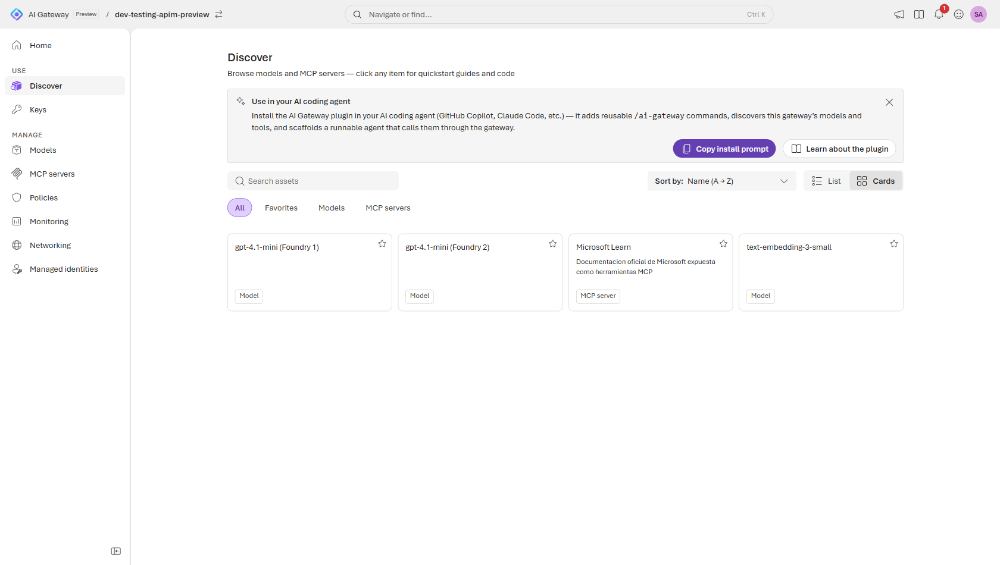
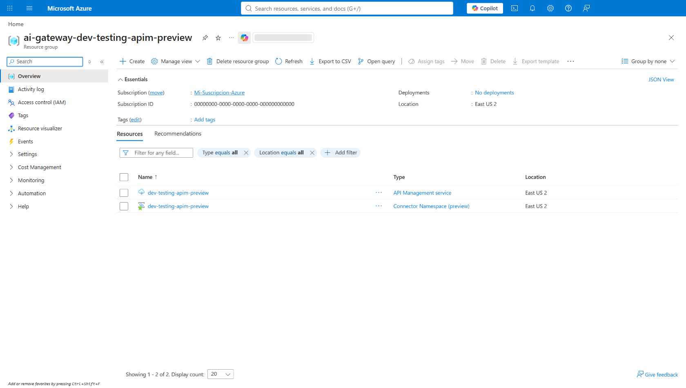
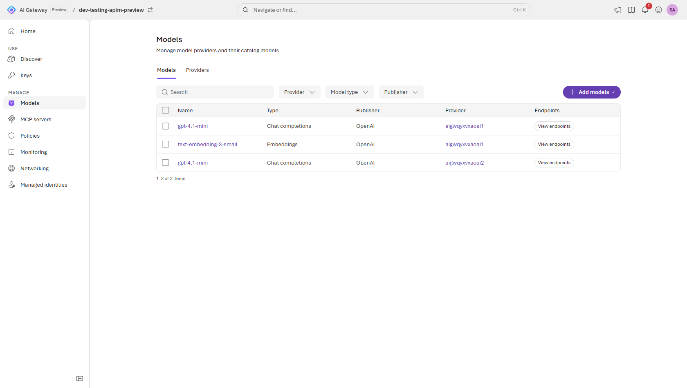
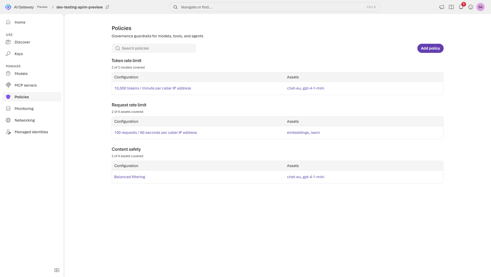
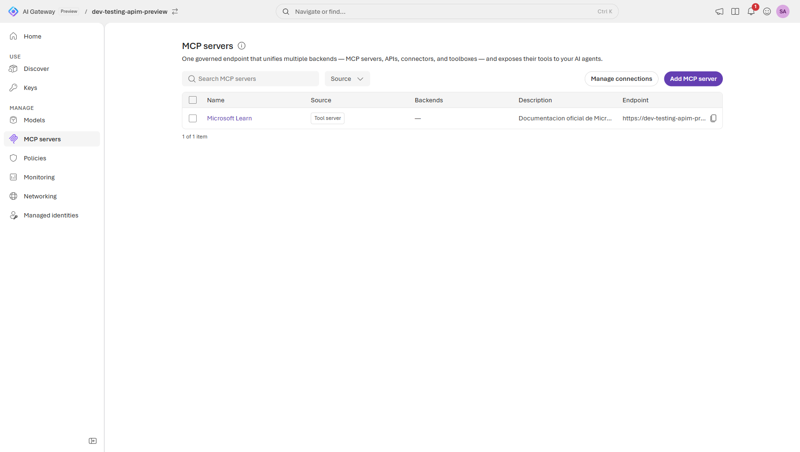
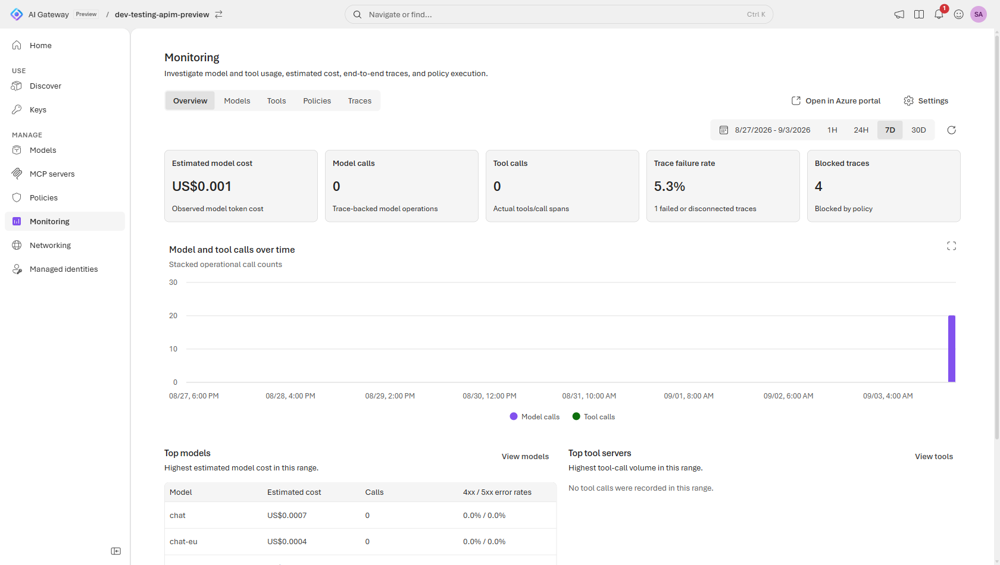
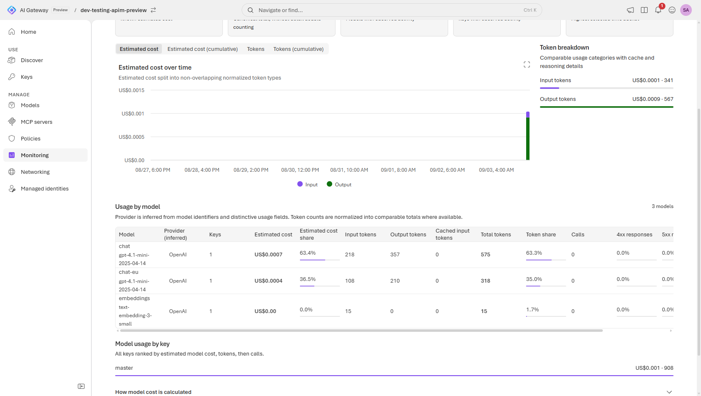
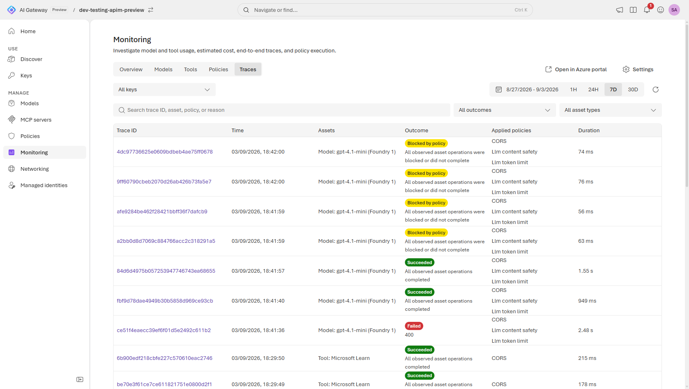
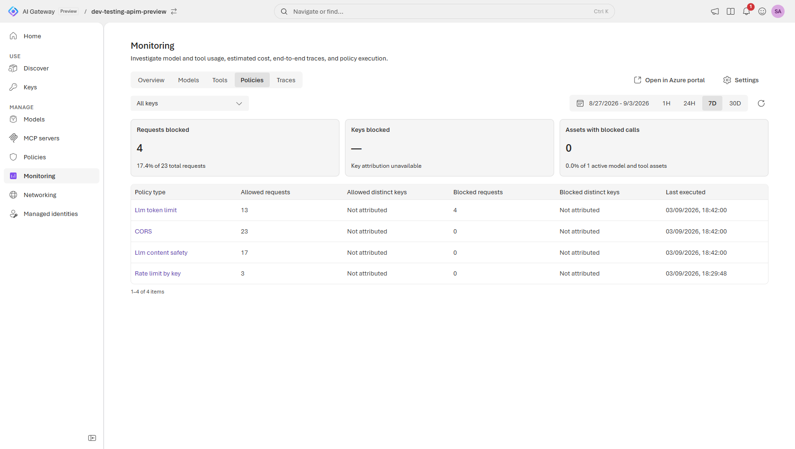

# Lab 13 · El SKU *AI Gateway* (preview) — la vía "moderna"

## Objetivo
Montar el mismo gobierno de los labs 01–07 y 10 sobre el **tier AI Gateway (preview)** de APIM:
un SKU nuevo, específico para tráfico de IA, donde **no se escriben políticas XML** — los modelos,
las herramientas MCP y las políticas se declaran como **objetos de configuración**.

> **Preview.** Sin SLA, precio no anunciado y solo en **East US 2** y **Sweden Central**.
> Es un **capítulo alternativo** del workshop, no un sustituto de los labs clásicos.
> Para producción hoy, el camino soportado sigue siendo el SKU clásico (v2).

Todo lo de este lab está automatizado en [`scripts/aigw-*.ps1`](../scripts/): modelos, servidor
MCP, políticas y telemetría. Si quieres ir al grano, salta a [Scripts](#scripts).



*La pantalla que resume el SKU: **modelos y servidores MCP conviven en el mismo catálogo**, con
la misma clave y el mismo gobierno. En el clásico son dos APIs distintas con dos políticas XML
distintas; aquí son fichas del mismo inventario.*

---

## En qué se diferencia del APIM clásico

| | APIM clásico (v2) | AI Gateway tier (preview) |
|---|---|---|
| Unidad de configuración | API + operaciones + **política XML** | **Modelos**, **MCP servers**, **políticas** declarativas |
| Autoría de políticas | XML con expresiones C# | Formulario/JSON, **sin XML ni expresiones** |
| Credencial de cliente | `subscription-key` de un *producto* | **runtime access key** en cabecera `api-key` |
| Ruta | la que definas (`/aoai`, `/claude`, …) | fija: `/default/models/...`, `/default/toolservers/...` |
| Backend Foundry | `backend` + `authentication-managed-identity` | **Import from Foundry** con Managed Identity |

La consecuencia importante: **lo que no exista como política declarativa, no se puede
implementar**. No hay una vía de escape a XML.

---

## Qué se porta y qué no

| Lab | Capacidad | ¿Portable? | Nota |
|-----|-----------|-----------|------|
| [01](01-desplegar-y-primera-llamada.md) | Primera llamada gobernada | ✅ | `Add models` + runtime access key |
| [02](02-token-limit.md) | Límite de tokens | ✅ | Política *Token rate limit*: por minuto, **hora o día** |
| [03](03-metricas-y-costes.md) | Métricas y coste | ✅ | Métrica OTel de tokens **y otra de coste en USD**, con modelo, tipo de token y clave de runtime |
| [04](04-balanceo-y-failover.md) | Balanceo / failover | ❌ | La API exige que `deployment.modelName` sea **único por workspace**: dos Foundry con un despliegue `chat` no pueden convivir |
| [05](05-semantic-cache.md) | Caché semántica | ❌ | No existe como política en preview |
| [06](06-content-safety.md) | Content safety / jailbreak | ✅ | Política *Content safety*, con Prompt Shields y blocklists |
| [07](07-managed-identity.md) | Managed Identity (keyless) | ✅ | Es el modo **recomendado** del asistente de importación |
| [10](10-mcp.md) | Gobierno de MCP | ✅➕ | Además: OpenAPI→tools y **+1000 conectores** integrados |
| [11](11-claude-en-foundry.md) | Claude nativo | ✅ | *Anthropic Messages passthrough* |
| [12](12-claude-code-sin-litellm.md) | Claude Code → GPT sin LiteLLM | ❌ | Necesita traducción en política XML → ver [abajo](#y-el-lab-12) |

Los dos huecos reales frente al SKU clásico son **caché semántica** y **balanceo entre
despliegues**. Conviene decirlo tal cual al cliente.

---

## Paso 0 · Registrar el feature flag

El tier no aparece — ni por portal ni por API — hasta registrarlo en la suscripción:

```powershell
az feature register --namespace Microsoft.ApiManagement --name AIGatewayPreview
az provider register --namespace Microsoft.ApiManagement
```

La propagación a ARM no es inmediata; hasta que termina, la API de gestión
`2026-05-01-preview` responde *"No registered resource provider found…"*.

```powershell
az feature show --namespace Microsoft.ApiManagement --name AIGatewayPreview --query properties.state -o tsv
```

Cuando creas el servicio con este tier, en el resource group aparecen **dos** recursos:



*El `API Management service` de siempre y, junto a él, un **Connector Namespace (preview)**. Ese
segundo recurso es el que sostiene los **+1000 conectores SaaS** del Paso 6: no lo creas tú ni lo
gestionas, pero conviene saber que está ahí antes de que alguien pregunte qué es.*

## Paso 1 · Dar acceso keyless a Foundry

El asistente de importación asigna el rol por ti **si tienes permiso**. Para hacerlo explícito
(y que la demo no dependa de ello):

```powershell
$principal = az apim show -g <rg-gateway> -n <gateway> --query identity.principalId -o tsv
foreach ($acct in @('aigwqyxvxaoai1','aigwqyxvxaoai2')) {
  az role assignment create --assignee-object-id $principal --assignee-principal-type ServicePrincipal `
    --role '53ca6127-db72-4b80-b1b0-d745d6d5456d' `   # Foundry User
    --scope "/subscriptions/<sub>/resourceGroups/rg-apim-workshop/providers/Microsoft.CognitiveServices/accounts/$acct"
}
```

## Paso 2 · Importar los modelos

**Models → Add models → Import from Foundry**: elige suscripción y recurso, y el asistente
**descubre los despliegues** solo. En *Provider details* escoge **Managed identity**.



*Los tres modelos ya importados. Fíjate en que **los dos `gpt-4.1-mini` se llaman igual** y solo
se distinguen por la columna "Provider" (`aigwqyxvxaoai1` y `aigwqyxvxaoai2`, las dos cuentas de
Foundry). Es la misma restricción que impide el balanceo: el nombre del despliegue es la clave
de enrutado y tiene que ser único por workspace.*

También se puede hacer por ARM (ver el bloque de abajo), pero hay un detalle que cuesta un rato
descubrir porque el síntoma engaña:

> ⚠️ **El `model` del cuerpo tiene que ser el nombre del *despliegue*, no el del modelo.**
> El gateway enruta por **coincidencia exacta** de `deployment.modelName`, y cuando no encuentra
> nada responde **`404` sin cuerpo** — el mismo error que si la ruta no existiera. Con un
> despliegue llamado `chat` que sirve `gpt-4.1-mini`:
>
> ```
> {"model":"gpt-4.1-mini"}  -> 404      el nombre del modelo NO vale
> {"model":"chat"}          -> 200      el nombre del despliegue SI
> ```
>
> El nombre que le pongas al recurso en el gateway (`.../models/<este>`) es solo una etiqueta:
> no interviene en el enrutado.

> **`foundry.endpoint` es obligatorio de facto** y tiene que ser el de *AI Foundry API*
> (`https://<cuenta>.services.ai.azure.com/`), que sale en
> `az cognitiveservices account show --query properties.endpoints`. Si lo omites, el modelo
> falla al crearse con `Parent provider '<p>' has no projected backend; cannot project model`.

> La unicidad se comprueba sobre **`deployment.modelName`**, no sobre el nombre que le pongas al
> modelo:
>
> ```
> ValidationError: A model with deployment.modelName 'chat' already exists in this workspace.
>                  Model names must be unique within a workspace.
> ```
>
> Como los dos Foundry del workshop tienen un despliegue llamado `chat`, **no puedes registrar
> los dos**. Se sortea renombrando: crea en el segundo un despliegue `chat-eu` y regístralo
> aparte. Pero eso te deja **dos modelos con nombres distintos**, no uno balanceado entre dos
> backends — por eso el [lab 04](04-balanceo-y-failover.md) sigue sin ser reproducible.

<details>
<summary>Modelo de objetos ARM (por si quieres inspeccionarlo)</summary>

Los assets **no cuelgan del servicio** sino de un workspace fijo llamado `default`, y los tipos
clásicos (`apis`, `backends`, `products`, `namedValues`, `subscriptions`, `policies`) devuelven
`400 Method not allowed in AIGateway pricing tier`:

```
.../service/<gw>/workspaces/default/modelProviders           # kind: Foundry | Custom
.../service/<gw>/workspaces/default/modelProviders/<p>/models
.../service/<gw>/workspaces/default/models                   # solo lectura, agregado
.../service/<gw>/workspaces/default/toolservers
.../service/<gw>/workspaces/default/telemetryExporters
.../service/<gw>/workspaces/default/agents                   # responde 200, vacío en preview
.../service/<gw>/apikeys                                     # ojo: a nivel de servicio
```

Las **políticas no aparecen en esa lista** porque no son un recurso: son un array
(`properties.policies`) dentro de cada modelo y de cada toolserver. Ver [Paso 4](#paso-4--políticas).

> ⚠️ **Los modelos y los servidores MCP son inmutables.** Un `PUT` sobre uno que ya existe no
> lo actualiza: el modelo choca con su propia comprobación de unicidad
> (`A model with deployment.modelName '<x>' already exists`) y el toolserver responde
> `404 Api not found`. Para cambiar cualquier cosa hay que **borrar y volver a crear**.
> Por eso el repo trae un [`aigw-cleanup.ps1`](../scripts/aigw-cleanup.ps1).
> El `PATCH` sí funciona, pero **solo para `policies`**.
>
> Con el toolserver además hay que tener cuidado: ese `PUT` fallido **sí llega a tocarlo**, y lo
> deja federando **cero herramientas** mientras sigue respondiendo `200`. Si `tools/list` te
> devuelve una lista vacía, bórralo y recréalo.

Un proveedor Foundry se describe así (`api-version=2025-09-01-preview`; las versiones
posteriores que cita la doc, incluida `2026-05-01-preview`, todavía no responden):

```json
{ "properties": { "kind": "Foundry", "displayName": "Foundry Sweden 1",
  "foundry": { "endpoint": "https://<cuenta>.services.ai.azure.com/",
    "resourceIds": [ "/subscriptions/.../accounts/<cuenta>" ],
    "authentication": { "kind": "ManagedIdentity" } } } }
```

Y un modelo, donde `supportedEndpoints` son **rutas relativas** y `modelName` es el nombre del
**despliegue** en Foundry (el valor que los clientes mandan en `model`):

```json
{ "properties": { "supportedEndpoints": [ "/chat/completions" ],
  "deployment": { "modelName": "chat", "resourceId": "/subscriptions/.../accounts/<cuenta>" } } }
```

`supportedEndpoints` se corresponde con lo que el asistente ofrece como *OpenAI chat
completions* (`/chat/completions`), *OpenAI responses* (`/responses`) y *Anthropic messages*.
El campo **no está validado** por la API —acepta cualquier cadena que empiece por `/`— pero el
runtime sí comprueba que el backend hable ese formato, así que declarar de más no sirve de nada.

Y un exportador de telemetría:

```json
{ "properties": { "displayName": "App Insights", "kind": "ApplicationInsights",
  "metrics": true,
  "applicationInsights": { "connectionString": "InstrumentationKey=...",
                           "resourceId": "/subscriptions/.../components/<appi>" } } }
```

Un servidor MCP usa `type` (no `kind`), con valores `Mcp`, `OpenApi` o `Connector`, y cada
endpoint indica su origen en `mcp.url` (inline) o `backendId` (referencia):

```json
{ "properties": { "displayName": "Microsoft Learn", "type": "Mcp",
  "endpoints": [ { "name": "learn", "kind": "Mcp",
    "mcp": { "url": "https://learn.microsoft.com/api/mcp" },
    "authentication": { "kind": "None" } } ] } }
```

Un proveedor `Custom` (para Anthropic, Bedrock, Vertex o cualquier endpoint propio) lleva la
credencial anidada dos niveles — `apiKey` es un objeto, no una cadena:

```json
{ "properties": { "kind": "Custom", "displayName": "Mi proveedor",
  "custom": { "endpoint": "https://...",
    "authentication": { "kind": "ApiKey",
      "apiKey": { "headerName": "x-api-key", "value": "<secreto>" } } } } }
```

Ojo: los Foundry del workshop se despliegan con `disableLocalAuth: true` (keyless, que es el
objetivo del [lab 07](07-managed-identity.md)), así que **no hay clave que pegar** en un
proveedor `Custom` que apunte a ellos: para Foundry hay que usar `kind: Foundry` con Managed
Identity.

</details>

## Paso 3 · Crear la runtime access key

**Keys → crear**. Sustituye a la clave de suscripción del producto. En preview la clave es
**de ámbito gateway**: da acceso a *todos* los assets publicados, no se puede acotar por modelo.

Un gateway recién creado ya trae una (`master`, *Built-in all-access subscription*). Para leerla
sin pasar por el portal:

```powershell
$svc = "/subscriptions/<sub>/resourceGroups/<rg>/providers/Microsoft.ApiManagement/service/<gw>"
az rest --method post --url "https://management.azure.com$svc/apikeys/master/listSecrets?api-version=2025-09-01-preview" --query primaryKey -o tsv
```

## Paso 4 · Políticas

**Policies → Add policy →** el asistente tiene tres pasos: **Type** (qué guardarraíl),
**Assets** (a qué modelos o MCP se aplica) y **Configure** (los campos, ya validados).
No hay XML ni expresiones.

| Política | Efecto | Aplica a | Equivalente clásico |
|----------|--------|----------|---------------------|
| **Content safety** | `400` con Prompt Shields y blocklists | modelos y MCP | `llm-content-safety` |
| **IP filter** | `403` fuera de la lista permitida | modelos y MCP | `ip-filter` |
| **Token rate limit** | `429` + `Retry-After` al superar tokens | **solo modelos** | `llm-token-limit` |
| **Request rate limit** | `429` + `Retry-After` por nº de peticiones | modelos y MCP | `rate-limit-by-key` |

Cuando aplican varias, el gateway **las evalúa todas** antes de llamar al backend; si una
bloquea, corta y devuelve el error sin gastar tokens del modelo.

Cómo configurar cada una:

1. **Content safety** — necesita un recurso de **Azure AI Content Safety**, que se elige como
   backend en *Configure*. Umbrales por categoría (odio, sexual, violencia, autolesión) con
   **4 u 8 niveles** de severidad, **Prompt Shields** para jailbreak e inyección indirecta, y
   **blocklists** de términos propios (nombres de competidores, por ejemplo). Se puede poner en
   **solo-log**: empieza así, calibra con tráfico real y luego pásalo a bloquear.
2. **IP filter** — rangos CIDR IPv4/IPv6 en lista de permitidos o denegados. Combínalo con la
   runtime access key: la clave autentica, la IP pone la frontera de red.
3. **Token rate limit** — tokens (prompt + completion) por **minuto, hora o día**, contados por
   **identidad del llamante** o por **IP**.
4. **Request rate limit** — número de llamadas en una ventana configurable (30 s, 1, 2 o 5 min).

Para que el reparto por identidad sirva de algo, **crea una clave por aplicación**: en preview
la clave es de ámbito gateway, así que es la única forma de separar presupuestos y atribuir
consumo.

> Las políticas **no son un recurso ARM propio**: viajan **dentro** del modelo o del toolserver,
> en `properties.policies`, y se aplican con un `PATCH` sobre el asset. Es exactamente la misma
> llamada que hace el asistente del portal, así que **sí se pueden automatizar**:
>
> ```http
> PATCH .../workspaces/default/modelProviders/{proveedor}/models/{modelo}?api-version=2025-09-01-preview
> { "properties": { "policies": [
>     { "type": "tokenLimit", "count": 10000, "period": "minute", "counterKey": "IPAddress" },
>     { "type": "contentSafety", "hateSeverity": "Medium", "violenceSeverity": "Medium",
>       "sexualSeverity": "Medium", "selfHarmSeverity": "Medium" }
> ] } }
> ```
>
> El `PATCH` **reemplaza la lista entera**, así que para añadir una política hay que mandar
> también las que ya estaban. Para quitarlas todas, `"policies": []`.
> Ojo: `.../workspaces/default/policies` responde `400 Method not allowed in AIGateway pricing
> tier`, porque ese es el recurso de políticas XML del APIM clásico, que aquí no existe.

Los siete tipos que acepta el control plane, con sus campos:

| `type` | Campos |
|--------|--------|
| `tokenLimit` | `count`, `period` (`minute`\|`hour`\|`day`), `counterKey` (`IPAddress`\|`Identity`) |
| `requestRateLimit` | `callsPerPeriod`, `periodSeconds`, `counterKey` |
| `costLimit` | `amount`, `period`, `counterKey`, `displayName`, `remainingCostHeaderName` |
| `contentSafety` | `hateSeverity`, `violenceSeverity`, `sexualSeverity`, `selfHarmSeverity` (`None`\|`Low`\|`Medium`\|`High`) |
| `ipFilter` | `action` (`Allow`\|`Deny`), `cidrRanges` |
| `fallback` | `threshold`, `tripDurationSeconds`, `fallbackTargets` |
| `cors` | `allowedOrigins`, `allowedMethods`, `allowedHeaders`, `exposeHeaders`, `allowCredentials`, `preflightResultMaxAge` |

`counterKey` es **obligatorio** en los tres límites; si falta, la API responde
`400 requestRateLimit.counterKey is required`.

> ⚠️ Las cabeceras de cuota **cambian de nombre** respecto al SKU clásico:
> aquí son `remaining-tokens` / `consumed-tokens` (en el clásico, `x-tokens-remaining` /
> `x-tokens-consumed`), más `remaining-quota-tokens` cuando el periodo es de una hora o más.
> Cualquier cliente que las lea hay que tocarlo.

### Crearlas y comprobar que hacen efecto

[`aigw-setup.ps1`](../scripts/aigw-setup.ps1) las aplica en su paso 6: límite de tokens y
content safety a los modelos de chat, límite de llamadas a los embeddings y al servidor MCP.

```powershell
cd scripts
./aigw-setup.ps1 -GatewayName <gw> -GatewayResourceGroup <rg-gateway> -TokensPerMinute 10000
```

```
=== 6. Politicas de gobierno ===
  [200] modelo 'embeddings' -> requestRateLimit
  [200] modelo 'gpt-4-1-mini' -> tokenLimit, contentSafety
  [200] modelo 'chat-eu' -> tokenLimit, contentSafety
  [200] toolserver 'learn' -> requestRateLimit
```

Y lo declarado por API sale en el portal, que es lo que conviene enseñar en la demo:



*Lo valioso de esta pantalla no son las políticas, es el **"2 of 3 models covered"** debajo de
cada una. El gateway te dice de un vistazo **qué assets se han quedado fuera** del guardarraíl —
en el APIM clásico eso hay que deducirlo leyendo el XML de cada API una por una.*

Después, [`aigw-policies-test.ps1`](../scripts/aigw-policies-test.ps1) lista lo que hay
declarado y lanza contra el gateway el tráfico que cada guardarraíl debería frenar. Con `-Demo`
baja el techo de tokens un momento para que el `429` salte a la segunda petición y lo restaura
al terminar:

```powershell
./aigw-policies-test.ps1 -GatewayName <gw> -GatewayResourceGroup <rg-gateway> -Demo
```

```
=== Politicas declaradas  (properties.policies de cada asset) ===
  modelo     embeddings       requestRateLimit
  modelo     chat             tokenLimit, contentSafety
  modelo     chat-eu          tokenLimit, contentSafety
  toolserver learn            requestRateLimit
  Total: 6 politicas

=== Token rate limit / Request rate limit  (esperado 429 + Retry-After) ===
  [demo] techo bajado a 10 tokens/minuto en 'chat'
    1. [200]
    2. [429]
       Retry-After: 180
       { "statusCode": 429, "message": "Token limit is exceeded. Try again in 180 seconds." }
  [demo] politicas originales restauradas en 'chat'
```

> ⚠️ **Un `400` no prueba que la política exista.** El despliegue de Azure OpenAI **ya trae su
> propio filtro de contenido**, y también responde `400`. Se distinguen por el cuerpo: el del
> modelo trae `ResponsibleAIPolicyViolation` y el detalle `content_filter_result`. El script lo
> separa por ti.
>
> Entonces, ¿qué aporta la política del gateway si el modelo ya filtra? Tres cosas: se aplica
> **igual a modelos que no filtran** (Bedrock, Vertex, un endpoint propio) y **a las tools MCP**,
> añade **blocklists propias** y **modo solo-log**, y queda **auditable en un solo sitio** para
> toda la flota en vez de despliegue por despliegue.

> El límite de tokens se contabiliza **después** de que responda el modelo, así que con techos
> altos hacen falta bastantes peticiones para llegar a él. Si no ves el `429`, usa `-Demo` o
> sube `-BurstSize`.


## Paso 5 · Probar

```powershell
$g   = "https://<gateway>.azure-api.net"
$key = "<runtime-access-key>"

# OJO: "model" es el nombre del DESPLIEGUE en Foundry, no el del modelo
$body = @{ model = "chat"; messages = @(@{ role = "user"; content = "Hola" }) } | ConvertTo-Json -Depth 5

Invoke-RestMethod -Uri "$g/default/models/openai/v1/chat/completions" -Method POST `
  -Headers @{ "api-key" = $key } -ContentType "application/json" -Body $body
```

Para embeddings, misma clave y misma raíz, cambiando la última parte de la ruta:

```powershell
$body = @{ model = "embeddings"; input = "hola mundo" } | ConvertTo-Json
Invoke-RestMethod -Uri "$g/default/models/openai/v1/embeddings" -Method POST `
  -Headers @{ "api-key" = $key } -ContentType "application/json" -Body $body
```

Fíjate en la ruta: el prefijo **`/default/models`** es fijo, y `openai/v1` es el *formato* de la
API, no el proveedor — Foundry, Azure OpenAI, Bedrock, Vertex y OpenAI comparten ese camino y se
distinguen por el campo `model`.

Para no ir una por una, [`aigw-test.ps1`](../scripts/aigw-test.ps1) recorre todas las superficies
—chat de cada modelo, embeddings, MCP y el rechazo sin clave— y acaba en una tabla:

```powershell
cd scripts
./aigw-test.ps1 -GatewayName <gw> -GatewayResourceGroup <rg-gateway>
```

```
Prueba                  HTTP OK Detalle
chat 'chat'              200 si 14 tokens, backend gpt-4.1-mini-2025-04-14
chat 'chat-eu'           200 si 14 tokens, backend gpt-4.1-mini-2025-04-14
embeddings 'embeddings'  200 si vector de 1536 dimensiones
mcp 'learn' tools/list   200 si 3 herramientas: microsoft_docs_search, ...
peticion sin api-key     401 si rechazada, correcto
```

## Paso 6 · MCP

**MCP servers → Add MCP server**. Un mismo servidor federa tres tipos de backend —
**MCP remoto** (por URL), **spec OpenAPI** (convierte operaciones en tools) y **conectores
integrados** (+1000 SaaS, sin servidor que hospedar). Cada backend prefija sus tools con su
nombre, así que dos `create_issue` de orígenes distintos no chocan.

```
https://<gateway>.azure-api.net/default/toolservers/<server>/mcp
```

Con la misma `api-key`. Es el punto donde este SKU **supera** claramente al clásico.



*"One governed endpoint that unifies multiple backends — MCP servers, APIs, connectors, and
toolboxes". Un solo servidor publicado (`Microsoft Learn`) que el agente consume por el endpoint
del gateway, no por el de origen: la clave del cliente es tuya y la puedes revocar.*

Para comprobar que federa bien, pídele la lista de tools por JSON-RPC:

```powershell
$body = '{"jsonrpc":"2.0","id":1,"method":"tools/list"}'
Invoke-RestMethod -Uri "$g/default/toolservers/learn/mcp" -Method POST `
  -Headers @{ "api-key" = $key; "Accept" = "application/json, text/event-stream" } `
  -ContentType "application/json" -Body $body
```

Apuntando el servidor al MCP público de Microsoft Learn (`https://learn.microsoft.com/api/mcp`),
la respuesta trae sus tres herramientas —`microsoft_docs_search`, `microsoft_code_sample_search`
y `microsoft_docs_fetch`— servidas ya por tu gateway y con tu clave, no con la del origen.

## Paso 7 · Observabilidad

**Monitoring →** eliges destino: **Application Insights** o cualquier colector **OTLP**
(Datadog, Splunk, Grafana Cloud). Es lo que configura el paso 5 de
[`aigw-setup.ps1`](../scripts/aigw-setup.ps1) sobre este recurso:

```
.../service/<gw>/workspaces/default/telemetryExporters/<nombre>
```

### Hay dos tipos de exportador y solo uno sirve para todo

| `kind` | Qué manda | Panel *Monitoring* del portal |
|---|---|---|
| `ApplicationInsights` | solo métricas (tokens y coste) | **vacío** — pide "Set up monitoring" |
| `OpenTelemetry` | métricas + logs + **trazas** | completo |

El panel del portal lee de la tabla **`OTelSpans`**, y a esa tabla solo escribe el exportador
OpenTelemetry. Si te queda el panel en blanco aunque `aigw-metrics.ps1` saque datos, es esto.



*Así queda el panel una vez configurado el modo OpenTelemetry. Los dos indicadores de la derecha
—**Trace failure rate** y **Blocked traces**— son los que no existen en ningún proxy LLM
genérico: no miden errores del modelo, miden **cuántas peticiones frenó tu gobierno**.*

### Cómo se configura el modo OpenTelemetry

No basta con crear el exportador: hay que preparar antes el destino. Son cuatro llamadas, y el
script las hace todas de forma idempotente.

**1. Activar la ingesta OTLP en el Application Insights.** Azure aprovisiona por detrás un DCE y
un DCR gestionados y publica tres endpoints. Ojo con la *api-version*, que es la del recurso de
App Insights y no la del gateway:

```http
PATCH https://management.azure.com{appInsightsId}?api-version=2020-02-02-preview
{ "properties": { "AzureMonitorWorkspaceIngestionMode": "Enabled" } }
```

**2. Esperar a que aparezcan los endpoints.** Tardan hasta un par de minutos; el asistente del
portal hace exactamente la misma espera:

```powershell
az resource show --ids <appInsightsId> --query "{m:properties.OTLPMetricsEndpoint, l:properties.OTLPLogsEndpoint, t:properties.OTLPTracesEndpoint}"
```

**3. Dar permiso al gateway sobre el DCR gestionado.** El gateway escribe con su identidad
administrada y necesita el rol **Monitoring Metrics Publisher**. Sin esto la ingesta falla en
silencio: ni error ni datos.

```powershell
az role assignment create --assignee-object-id <principalId del gateway> `
  --assignee-principal-type ServicePrincipal --role "Monitoring Metrics Publisher" `
  --scope "/subscriptions/<sub>/resourceGroups/ai_<appInsights>_<appId>_managed/providers/Microsoft.Insights/dataCollectionRules/managed-<appInsights>-dcr"
```

**4. Crear el exportador y encender las señales.**

```http
PUT .../workspaces/default/telemetryExporters/appinsights?api-version=2025-09-01-preview
{ "properties": {
    "kind": "OpenTelemetry",
    "payloadCapture": false,
    "applicationInsights": { "resourceId": "<appInsightsId>" },
    "openTelemetry": {
      "metricsEndpoint": "...", "logsEndpoint": "...", "tracesEndpoint": "...",
      "credentials": { "managedIdentity": { "resource": "https://monitor.azure.com" } }
} } }
```

```http
PATCH .../telemetryExporters/appinsights?api-version=2025-09-01-preview
{ "properties": { "kind": "OpenTelemetry", "metrics": true, "tracing": true } }
```

Tres trampas que cuestan una tarde:

> ⚠️ **El exportador nace con `metrics: false` y `tracing: false`.** Aunque el `kind` sea
> correcto, si no mandas el PATCH del punto 4 no llega nada.
>
> ⚠️ **El PATCH de `tracing` exige repetir `kind` en el mismo cuerpo.** Si mandas solo
> `{"tracing": true}` responde `400 Tracing is currently supported only for OpenTelemetry
> telemetry exporters` aunque el exportador ya lo sea.
>
> ⚠️ **`kind` es inmutable.** Para pasar de `ApplicationInsights` a `OpenTelemetry` hay que
> **borrar y recrear**: un PUT responde `400 Telemetry exporter kind cannot be changed after
> creation`. Y sobre un exportador ya existente, el PUT completo choca con las credenciales que
> el servicio normaliza al crearlo (`OpenTelemetry credentials cannot be patched together with
> top-level headers or managedIdentity`): para actualizar hay que usar PATCH campo a campo, que
> es justo lo que hace el portal.

`payloadCapture` guarda el prompt y la respuesta completos dentro de la traza. Ayuda a depurar,
pero manda datos de usuario a Log Analytics: en el script está apagado y se activa a mano con
`-CapturePayloads`.

### Qué llega: métricas

La documentación llama a la métrica `gen_ai_client_token_usage` porque así se ve **desde
PromQL**. Dentro de Application Insights aterriza en `customMetrics` con otro nombre:

| Métrica en `customMetrics` | Qué es |
|---|---|
| `azure.ai_gateway.client.token.usage` | tokens consumidos |
| `azure.ai_gateway.client.token.cost` | **coste estimado**, con `azure.ai_gateway.currency` |

La de coste no aparece en la documentación, pero se emite: trae divisa y un
`azure.ai_gateway.price_missing` que marca los tipos de token para los que no hay tarifa.

Cada muestra viene con las convenciones semánticas de OpenTelemetry más las propias de Azure:

| Dimensión | Para qué sirve |
|---|---|
| `gen_ai.request.model` | lo que pidió el cliente (el nombre del **despliegue**) |
| `gen_ai.response.model` | el modelo real que respondió — comparado con el anterior, enseña el enrutado |
| `gen_ai.token.type` | `prompt_tokens`, `completion_tokens`, `total_tokens`, cacheados, razonamiento… |
| `gen_ai.operation.name` | `chat`, `responses`… |
| `azure.ai_gateway.api_key_id` | **qué clave de runtime lo consumió** → atribución por aplicación |

Es decir: con una clave por aplicación tienes repartición de consumo y de coste sin tocar nada
más. [`aigw-metrics.ps1`](../scripts/aigw-metrics.ps1) saca todo eso por consola:

```powershell
cd scripts
./aigw-metrics.ps1              # últimas 3 h
./aigw-metrics.ps1 -Hours 24
```

```
=== Tokens por modelo ===
modelo     backend                 completion_tokens prompt_tokens total_tokens
chat       gpt-4.1-mini-2025-04-14               341           313          654
chat-eu    gpt-4.1-mini-2025-04-14               373           284          657
embeddings text-embedding-3-small                  0            36           36

=== Consumo por clave de runtime ===
clave  modelo     tokens llamadas
master chat-eu       657       20
master chat          654       26
master embeddings     36        9
```

Lo mismo, sin consola, en la pestaña *Monitoring → Models*:



*El gateway **infiere el proveedor** a partir del identificador del modelo, normaliza los tokens
a categorías comparables (entrada, salida, cacheados, razonamiento) y reparte el coste estimado:
`chat` se lleva el 63,4 % del gasto. Abajo, en "Model usage by key", la atribución por clave de
runtime — una clave por aplicación y tienes el chargeback hecho.*

La consulta de fondo es KQL normal sobre `customMetrics`:

```kusto
customMetrics
| where name == "azure.ai_gateway.client.token.usage"
| extend modelo = tostring(customDimensions["gen_ai.request.model"]),
         tipo   = tostring(customDimensions["gen_ai.token.type"])
| where tipo == "total_tokens"
| summarize tokens = sum(valueSum) by modelo
```

Y la misma métrica desde PromQL, si tu destino es un colector OTLP:

```promql
sum by (gen_ai_request_model) (gen_ai_client_token_usage)
```

### Qué llega: trazas — la parte que enseña el gobierno

Aquí está lo interesante. El gateway emite **un span por cada fase y por cada política
evaluada**, así que la traza es la prueba en ejecución de que los guardarraíles del Paso 4 se
están aplicando. [`aigw-traces.ps1`](../scripts/aigw-traces.ps1) lo saca por consola:

```powershell
cd scripts
./aigw-traces.ps1
./aigw-traces.ps1 -Hours 24 -Trace <TraceId>
```

```
=== Politicas evaluadas ===
politica              seccion  ambito desenlace veces media ms
llm-token-limit       inbound  api    success      10     0.05
llm-content-safety    inbound  api    success      10    90.86
llm-content-safety    outbound api    success      10     0.02
rate-limit-by-key     inbound  api    success       3     0.05
set-backend-service   inbound  api    success      13     0.01
llm-emit-token-metric inbound  global success      16     0.11
forward-request       backend  global success      16  1009.93

=== Detalle de una peticion ===
POST /default/models/*                        1720.20 ms  success
  inbound                                        0.51 ms  success
    policy cors                                  0.01 ms  success
    policy llm-emit-token-metric                 0.14 ms  success
    policy llm-token-limit                       0.05 ms  success
    policy llm-content-safety                   90.86 ms  success
    policy set-backend-service                   0.01 ms  success
  backend                                     1620.30 ms  success
    policy forward-request                    1620.10 ms  success
  outbound                                       0.24 ms  success
```

Fíjate en dos datos que solo se ven así:

- **`llm-content-safety` cuesta ~90 ms** de los ~1,7 s de la petición. El gobierno no es gratis,
  y aquí tienes la cifra para decidir dónde aplicarlo.
- **`set-backend-service` aparece 13 veces y `llm-token-limit` 10**: los embeddings llevan otras
  políticas. El desglose confirma que cada asset tiene los guardarraíles que le tocan.

Cuando una política corta la petición, el span raíz deja de ser `success` y se ve quién cortó.
Lánzalo después de `./aigw-policies-test.ps1 -Demo` para verlo.

Y lo mismo en el portal, sin escribir KQL. **Monitoring → Traces** lista cada petición con su
desenlace y las políticas que se le aplicaron:



*Tres desenlaces distintos en la misma lista: `Succeeded`, `Failed 400` (lo rechazó el modelo) y
`Blocked by policy` (lo rechazó **el gateway**). La columna "Applied policies" dice qué
guardarraíles se evaluaron en cada una. Abajo aparecen también las llamadas a `Tool: Microsoft
Learn`: modelos y herramientas comparten la misma vista.*

Al abrir una de las bloqueadas se ve el *waterfall* completo — es la mejor captura para una demo:


*11 spans, 74 ms, y la etiqueta **Blocked by policy** propagándose hasta el span raíz. El motivo
está en el span concreto: `policy llm-token-limit · OpenAITokenLimitExceeded`. Dos lecturas que
solo da la traza:*

- *La petición **nunca llegó al modelo**: no hay span de `backend`. El corte es en `inbound`, así
  que no se ha pagado ni un token al proveedor.*
- ***Se pagaron 73 de los 74 ms en `llm-content-safety` antes de rechazar por cuota.** El orden de
  evaluación importa: si el límite de tokens fuera antes, ese análisis se habría ahorrado.*

Y una vista agregada de lo mismo en **Monitoring → Policies**:



*El KPI que se lleva un CISO a una reunión: **4 peticiones bloqueadas, el 17,4 % de 23**, y el
desglose de permitidas/bloqueadas por tipo de política. Content safety evaluó 17 peticiones sin
bloquear ninguna; el límite de tokens bloqueó 4 de 17. Esto es evidencia de cumplimiento, no
telemetría de rendimiento.*

Los atributos útiles de cada span:

| Atributo | Qué es |
|---|---|
| `azure.apim.policy.type` | la política concreta: `llm-token-limit`, `llm-content-safety`… |
| `azure.apim.policy.section` | `inbound`, `outbound`, `backend` |
| `azure.apim.policy.scope` | `global`, `api` — dónde está declarada |
| `azure.apim.outcome` | `success` o el motivo del corte |
| `azure.apim.api.name` | el modelo registrado que atendió |
| `http.route` / `http.response.status_code` | ruta y código |

Y el KQL, por si prefieres el portal de Azure:

```kusto
OTelSpans
| where TimeGenerated > ago(1h) and Name startswith "policy "
| extend politica = tostring(Attributes["azure.apim.policy.type"]),
         desenlace = tostring(Attributes["azure.apim.outcome"])
| summarize veces = count(), ["media ms"] = round(avg(DurationMs), 2) by politica, desenlace
| order by veces desc
```

> El tráfico de tools MCP **sí** aparece en las trazas (`POST /default/toolservers/<x>/mcp`),
> pero no emite métrica de tokens: es una llamada a herramienta, no a modelo. Y no todos los
> backends reportan tokens —algunos los omiten en streaming o en passthrough—: trátalo como
> *dato no disponible*, no como cero.
>
> Además, el contador **Tool calls** del panel solo suma `tools/call`. Un `tools/list` —que es lo
> que hace `aigw-test.ps1`— sale en la lista de trazas pero deja la pestaña *Tools* a cero: no es
> un fallo de telemetría, es que descubrir herramientas no es invocarlas.

---

## Scripts

Todo lo automatizable de este lab está en [`scripts/`](../scripts/), pensado para lanzarse en
este orden:

| Script | Qué hace |
|---|---|
| [`aigw-setup.ps1`](../scripts/aigw-setup.ps1) | Comprueba feature flag e identidad, asigna *Foundry User*, crea proveedores, modelos, MCP, telemetría OTLP y políticas. Idempotente. |
| [`aigw-test.ps1`](../scripts/aigw-test.ps1) | Prueba de humo: chat, embeddings, MCP `tools/list`, rechazo sin clave. Acaba en tabla de resultados. |
| [`aigw-policies-test.ps1`](../scripts/aigw-policies-test.ps1) | Lista las políticas declaradas, comprueba su efecto y con `-Demo` fuerza el `429`. |
| [`aigw-metrics.ps1`](../scripts/aigw-metrics.ps1) | Lee de Application Insights tokens, coste y consumo por clave. |
| [`aigw-traces.ps1`](../scripts/aigw-traces.ps1) | Lee de Log Analytics las trazas OTLP: qué políticas se evaluaron, cuánto costó cada una y el árbol de spans de una petición. |
| [`aigw-cleanup.ps1`](../scripts/aigw-cleanup.ps1) | Vacía los assets. Necesario para *cambiar* modelos o MCP, que son inmutables. Con `-Only policies` quita solo los guardarraíles. |

```powershell
cd scripts
./aigw-setup.ps1        -GatewayName <gw> -GatewayResourceGroup <rg-gateway>
./aigw-test.ps1         -GatewayName <gw> -GatewayResourceGroup <rg-gateway>
./aigw-policies-test.ps1 -GatewayName <gw> -GatewayResourceGroup <rg-gateway> -Demo
./aigw-metrics.ps1
./aigw-traces.ps1
```

El recorrido completo son unos 3 minutos y deja el gateway montado, probado, con políticas
aplicadas y con telemetría llegando, sin tocar el portal en ningún momento.


---

## ¿Y el lab 12?

El [puente Anthropic→OpenAI](12-claude-code-sin-litellm.md) son ~27 KB de política XML. Aquí no
hay XML, y el proveedor Anthropic del tier es **passthrough**: reenvía el formato Messages tal
cual a `api.anthropic.com` inyectando la `x-api-key` del backend. **No traduce a OpenAI.**

Quedan dos salidas honestas:

1. **Dejar el puente en el APIM clásico** y presentarlos como dos gateways con propósitos
   distintos. Es lo más limpio.
2. **Encadenar**: en el tier nuevo, `Add models → Add a custom model` con endpoint
   `https://apim-aigw-dev-01.azure-api.net/claude`, cabecera de autenticación `x-api-key` y el
   *endpoint* **Anthropic messages**. Claude Code habla con el gateway moderno (que aplica
   límites y content safety) y el clásico hace la traducción.

```
Claude Code ─► AI Gateway (governance) ─► APIM clásico (traduce) ─► Foundry (GPT)
```

La opción 2 demuestra bien el gobierno, pero son **dos saltos** y dos facturas: úsala como
demo, no como arquitectura recomendada.

---

## Siguiente
➡️ Vuelve al [menú del README](../README.md) o al guión de demo [`DEMO-portal.md`](DEMO-portal.md).
